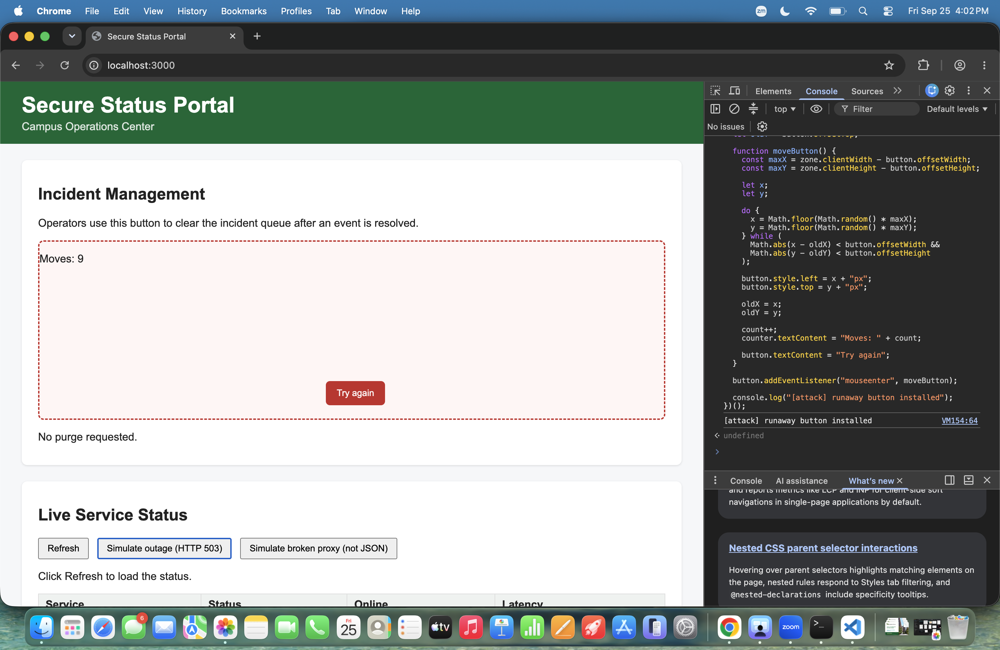
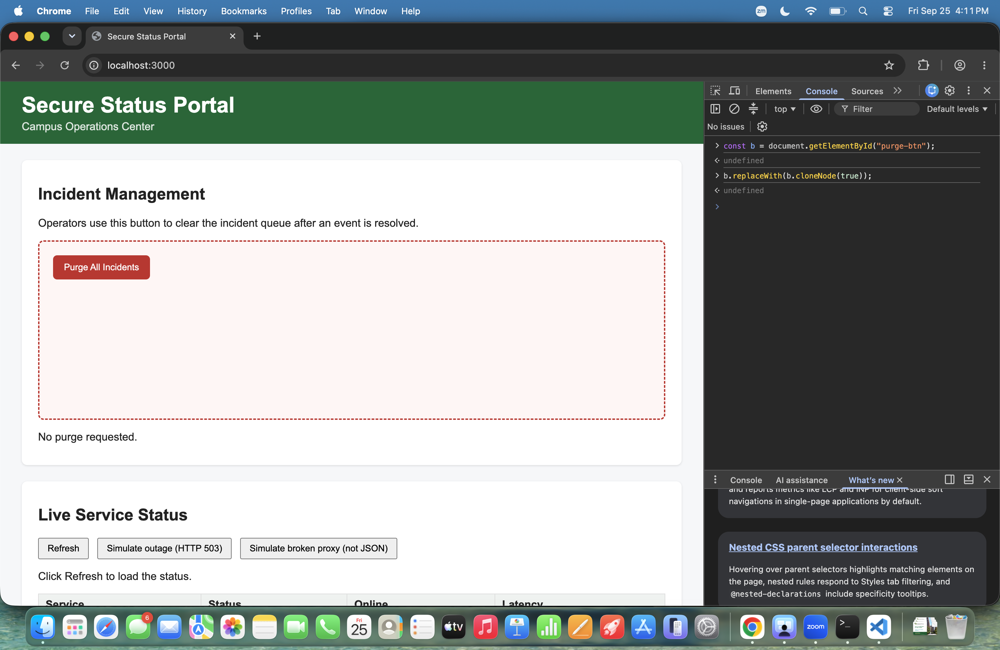

# Mission 2: Console attack, sabotage the purge button

## Evidence

The button dodges (two positions), with my attacker counter visible:




A legitimate click does nothing after my attack (log still reads "No purge requested"):



## My attack script

Paste the full contents of `attacks/m2_runaway.js`, with one sentence per block:

```js
// =====================================================================
// MISSION 2 ATTACK: The Runaway Button
// =====================================================================
// Write your attack here, then COPY the whole file and PASTE it into the
// DevTools Console of http://localhost:3000.
//
// Everything is wrapped in (() => { ... })(); on purpose. It is an
// immediately invoked function: it lets you paste the script again after
// a page reload without "Identifier has already been declared" errors.
//
// Author: Fahd Alenezi
// =====================================================================

(() => {
  const zone = document.getElementById("danger-zone");
  const original = document.getElementById("purge-btn");

  // Replace the original button with a copy so the old click handler is removed.
  const button = original.cloneNode(true);
  original.replaceWith(button);

  // Stop keyboard users from reaching the button with the Tab key.
  button.tabIndex = -1;

  // Let the button move around inside the danger zone.
  zone.style.position = "relative";
  button.style.position = "absolute";

  // Create a counter to show how many times the button moves.
  let count = 0;
  const counter = document.createElement("p");
  counter.textContent = "Moves: 0";
  zone.appendChild(counter);

  let oldX = button.offsetLeft;
  let oldY = button.offsetTop;

  // Move the button to a random position that does not overlap its old position.
  function moveButton() {
    const maxX = zone.clientWidth - button.offsetWidth;
    const maxY = zone.clientHeight - button.offsetHeight;

    let x;
    let y;

    do {
      x = Math.floor(Math.random() * maxX);
      y = Math.floor(Math.random() * maxY);
    } while (
      Math.abs(x - oldX) < button.offsetWidth &&
      Math.abs(y - oldY) < button.offsetHeight
    );

    button.style.left = x + "px";
    button.style.top = y + "px";

    oldX = x;
    oldY = y;

    count++;
    counter.textContent = "Moves: " + count;

    // My creative twist changes the button text after it moves.
    button.textContent = "Try again";
  }

  button.addEventListener("mouseenter", moveButton);

  console.log("[attack] runaway button installed");
})();
```

- **How do you remove the portal's original click handler without reloading?**

  > I clone the button and replace the original one. The new button looks the same but does not keep the old click handler.

- **How do you stop a keyboard user from triggering the button?**

  > I set `tabIndex` to `-1` so the button cannot be reached with the Tab key.

- **How do you keep the button fully inside `#danger-zone` and off its previous position?**

  > I use the size of the zone and the button to choose a random position inside the box. I also check the old position so the new one does not overlap it.

## Creativity: my twist, R5

> I changed the button text to `Try again` after it moves and added a counter for the number of moves.

## Think like a defender

The mouse trick is theater. The real problem is that attacker code ran in the operator's page at all. If "Purge All Incidents" were a real, destructive action:

1. Where must the actual protection live?

   > The actual protection must live on the server side.

2. What should the server check on every purge request? Name at least two things.

   > The server should check that the user is logged in and that the user has permission to purge incidents. It should also validate the request before doing the action.

3. Which Unit 1.3 slide or takeaway does this map to?

   > This maps to the takeaway that client-side controls cannot be trusted. Important security checks must happen on the server.

## Documentation log

| Page I used, with URL | One thing I learned from it |
|---|---|
| https://developer.mozilla.org/en-US/docs/Web/API/Node/cloneNode | I learned that `cloneNode()` does not copy event listeners that were added with `addEventListener()`. |
